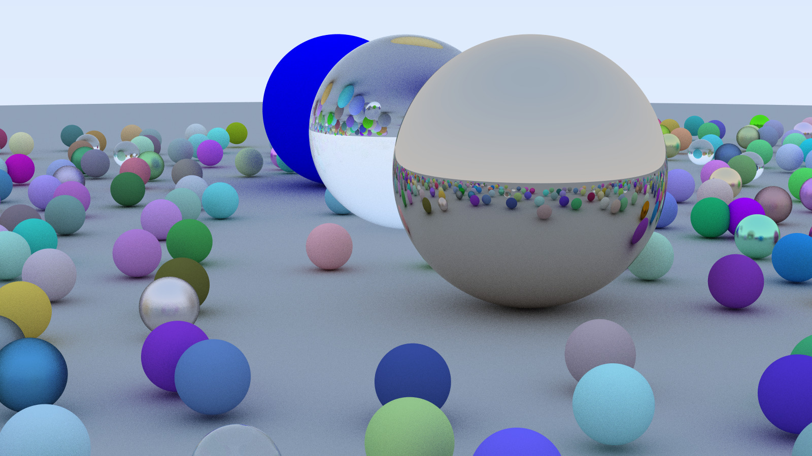

# OCaml-Raytracer
A simple OCaml Raytracer based on my notes from the Cambridge Graphics course and the ''Fundamental of
Computer Graphics'' book.

A functional realization of a raytracer taking advantage of
OCaml's module system and algebraic data types; in an attempt
to generalize the interfaces of components within a raytracer. 

Some features of the raytracer:
- Surfaces: Spheres and planes.
- Materials: Lambertian, Metallic and Dielectric materials.
- Camera: Defined using a viewer, view plane and projection.
- Gamma correction. 

Images are stored in a PPM format, with `image.ml` ported from FoCS tick 5 (Thanks [Anil](https://github.com/avsm)!).

An example scene (specified by Peter Shirley's mini-book series [Raytracing in One Weekend](https://raytracing.github.io/)):

